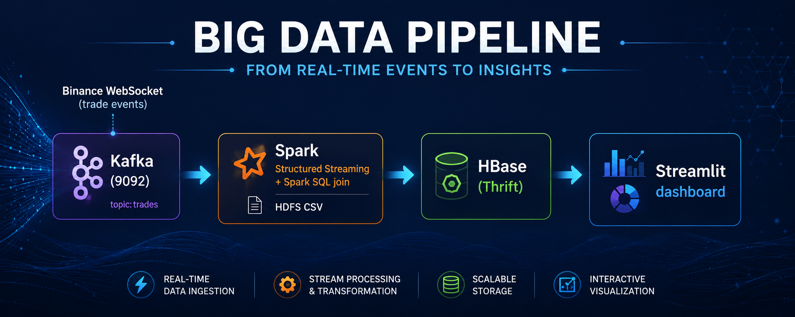

# BDT Final Project — Real-Time Crypto Trade Pipeline

End-to-end big-data pipeline that ingests live cryptocurrency trades from
the Binance.US public WebSocket, processes them with Apache Spark
Structured Streaming (enriched via a Spark SQL join against a static
dataset on HDFS), persists results to HBase, and visualizes them through
a Streamlit dashboard. The whole stack runs locally with **Docker
Compose**.



## Architecture

```
Binance WebSocket
        │  (trade events)
        ▼
┌───────────────┐     ┌──────────────────────────────┐     ┌───────────┐     ┌──────────────┐
│  Kafka (9092) │ ──▶ │ Spark Structured Streaming   │ ──▶ │ HBase     │ ──▶ │  Streamlit   │
│  topic:trades │     │ + Spark SQL join (HDFS CSV)  │     │ (Thrift)  │     │  dashboard   │
└───────────────┘     └──────────────────────────────┘     └───────────┘     └──────────────┘
                                ▲
                                │ static reference
                          HDFS  │  /seed/symbols.csv
```

| Stage             | Tech                       | Where                    |
| ----------------- | -------------------------- | ------------------------ |
| Ingestion         | Apache Kafka + Zookeeper   | `producer/`              |
| Static reference  | HDFS (NameNode + DataNode) | `hdfs/seed/symbols.csv`  |
| Stream processing | Apache Spark 3.5 (PySpark) | `spark/streaming_job.py` |
| Storage           | Apache HBase 2.1 (Thrift)  | `hbase/init_tables.py`   |
| Visualization     | Streamlit                  | `dashboard/app.py`       |

## Repository layout

```
.
├── docker-compose.yml        # orchestrates the entire stack
├── hadoop.env                # HDFS configuration
├── producer/                 # Binance WS → Kafka producer (Python)
├── spark/                    # Spark Structured Streaming job
├── hbase/                    # init container: creates trade_agg, trade_latest
├── hdfs/seed/symbols.csv     # static reference dataset
├── scripts/seed_hdfs.sh      # uploads symbols.csv into HDFS on startup
├── dashboard/                # Streamlit app
├── pipeline_flow.png         # pipeline flow diagram
└── README.md
```

## Prerequisites

- Docker Desktop (or Docker Engine) with **at least 8 GB RAM** allocated.
- Outbound internet access (the producer connects to
  `wss://stream.binance.us:9443`). If you are outside the US, override
  `BINANCE_HOST` on the `producer` service in `docker-compose.yml`
  (e.g. `stream.binance.com:9443`).
- Ports free on host: `9092` (Kafka), `8501` (dashboard),
  `9871`/`9001`/`9865` (HDFS NN UI / NN RPC / DN UI),
  `16010`/`9090` (HBase UI / Thrift), `2182` (HBase ZK),
  `4040` (Spark application UI).

## Quick start

```bash
# 1. Build and start the stack
docker compose up -d --build

# 2. Watch services come up (Kafka, HDFS, HBase have healthchecks)
docker compose ps

# 3. Tail the Spark job to see streaming progress
docker compose logs -f spark

# 4. Open the dashboard
open http://localhost:8501
```

The first start can take a few minutes while images download and HBase
initializes. Init containers (`hdfs-seed`, `hbase-init`) run once and exit
with `Exited (0)` — that is expected.

**Boot order** (handled automatically by `depends_on`):
`zookeeper` → `kafka` (healthy) + `namenode`/`datanode` → `hdfs-seed`
(uploads `symbols.csv`) → `hbase` (healthy) → `hbase-init` (creates
tables) → `spark` (subscribes to Kafka) and `producer` (starts streaming
trades) → `dashboard`. Expect ~1 minute after producer start before the
first 1-minute aggregation window closes and the dashboard becomes
populated.

### Useful URLs

| URL                    | Purpose                                               |
| ---------------------- | ----------------------------------------------------- |
| http://localhost:8501  | Streamlit dashboard                                   |
| http://localhost:9871  | HDFS NameNode UI                                      |
| http://localhost:16010 | HBase Master UI                                       |
| http://localhost:4040  | Spark application UI (job running in `local[2]` mode) |

### Verifying each stage

```bash
# Kafka — peek at trades topic
docker exec -it kafka kafka-console-consumer \
  --bootstrap-server kafka:29092 --topic trades --max-messages 5

# HDFS — confirm symbols.csv landed
docker exec -it namenode hdfs dfs -cat hdfs://namenode:9000/seed/symbols.csv

# HBase — list rows
docker exec -it hbase bash -c 'echo "scan \"trade_latest\", {LIMIT => 5}" | hbase shell -n'
```

### Stopping / cleaning up

```bash
docker compose down          # stop containers, keep volumes
docker compose down -v       # also remove volumes (full reset)
```

## Configuration

Tunable via environment variables in `docker-compose.yml`:

| Service     | Variable                    | Default                                 | Purpose                                                           |
| ----------- | --------------------------- | --------------------------------------- | ----------------------------------------------------------------- |
| `producer`  | `SYMBOLS`                   | `btcusdt,ethusdt,solusdt,adausdt`       | Binance trade streams to subscribe to                             |
| `producer`  | `BINANCE_HOST`              | `stream.binance.us:9443`                | Binance WebSocket host (use `stream.binance.com:9443` outside US) |
| `producer`  | `KAFKA_TOPIC`               | `trades`                                | Destination Kafka topic                                           |
| `spark`     | `KAFKA_BOOTSTRAP`           | `kafka:29092`                           | Kafka cluster address                                             |
| `spark`     | `HDFS_SYMBOLS`              | `hdfs://namenode:9000/seed/symbols.csv` | Static reference dataset                                          |
| `dashboard` | `HBASE_HOST` / `HBASE_PORT` | `hbase` / `9090`                        | HBase Thrift gateway                                              |

## Summary

1. **Real-time ingestion (Kafka)** — `producer/producer.py` connects to the
   Binance combined `@trade` WebSocket and publishes JSON events to Kafka.
2. **Distributed processing (Spark Structured Streaming)** —
   `spark/streaming_job.py` reads Kafka, applies a 30s watermark, then
   computes 1-minute tumbling windows per symbol with VWAP, avg/min/max
   price, total volume, trade count, and a 3σ anomaly flag.
3. **Persistent storage (HBase)** — two tables created by
   `hbase/init_tables.py` (run once via the `hbase-init` container, which
   talks to HBase over the Thrift gateway):
   - `trade_agg` (rowkey = `symbol#window_end_ms`) — windowed aggregates.
   - `trade_latest` (rowkey = `symbol`) — most recent price/qty per symbol
     for the dashboard's live ticker.
4. **Visualization (Streamlit)** — `dashboard/app.py` polls HBase via the
   Thrift gateway every few seconds and renders a live ticker, per-symbol
   VWAP/volume charts, and an anomaly table.
5. **Bonus — Spark SQL + HDFS join** — `hdfs/seed/symbols.csv` is uploaded
   to HDFS at startup by `scripts/seed_hdfs.sh`. The Spark job loads it as
   a Spark SQL DataFrame and `JOIN`s each trade with `name`/`category`
   metadata before aggregation.

## Troubleshooting

- **`producer` logs `HTTP 451`** — Binance.com is geo-blocked from your
  region. The default already uses Binance.US; if you are outside the US,
  set `BINANCE_HOST=stream.binance.com:9443` on the `producer` service.
- **`producer` keeps reconnecting** — check outbound network access; some
  corporate networks block all Binance domains. Switch the producer to a
  different public WS (Coinbase, Kraken) by editing `producer/producer.py`.
- **`hbase-init` exits with error** — re-run it manually:
  `docker compose up hbase-init`. It is idempotent.
- **`spark` exits with `UnknownTopicOrPartitionException`** — Spark
  started before the producer created the `trades` topic. Just
  `docker compose up -d spark` again once `producer` is running.
- **Dashboard shows "Waiting for first records…"** — give Spark ~1 minute
  after producer start so the first 1-minute window can close.
- **Out of memory** — reduce `SYMBOLS` to a single pair (e.g. `btcusdt`)
  and/or raise Docker Desktop memory to 10 GB.
- **Port already allocated** — another container/process is bound to one
  of the host ports above. Either stop it or edit the `ports:` mappings
  in `docker-compose.yml` (only the left-hand host port matters).
